# Enterprise Active Directory and GPO Management Lab – ADATUM.COM

This lab demonstrates a full Active Directory and Group Policy Management implementation in a simulated enterprise setup using Windows Server 2022. The goal was to configure user accounts, organizational units, delegation, permissions, GPOs, and firewall rules in a domain environment.

---

## Tools Used

- Active Directory Users and Computers (ADUC)
- Active Directory Administrative Center (ADAC)
- Group Policy Management Console (GPMC)
- Windows Admin Center
- Windows Defender Firewall with Advanced Security
- Event Viewer

---

## Key Tasks & Activities

### 1. **Active Directory Management**
- Created a domain structure for `adatum.com`.
- Built OUs like IT, Marketing, Managers, Service Accounts, Research, etc.
- Created and managed user accounts (e.g., Colin Hunt, Beth Burke).
- Applied logon hour restrictions and account policies.
- Enabled protection against accidental deletion.

### 2. **Group and Role Management**
- Created Security Groups like `ITADMINS`.
- Assigned users to groups.
- Delegated specific control to ITADMINS (reset passwords, manage group memberships).

### 3. **Group Policy Management**
- Created and linked GPO `EndpointBaseline-6803` to domain and Domain Controllers.
- Configured ADMX templates including:
  - LAPS (Local Administrator Password Solution)
  - MSS security settings
  - Start Menu, Control Panel, and Windows Components

### 4. **Firewall Hardening**
- Configured inbound and outbound firewall rules:
  - Allowed: Notepad, RDP, system apps.
  - Blocked: Internet Explorer, Edge, SMTP, Xbox services.
- Verified logs in Event Viewer (RuleName: Block Internet Explorer).

---

## 📸 Screenshots

### OU and Account Setup
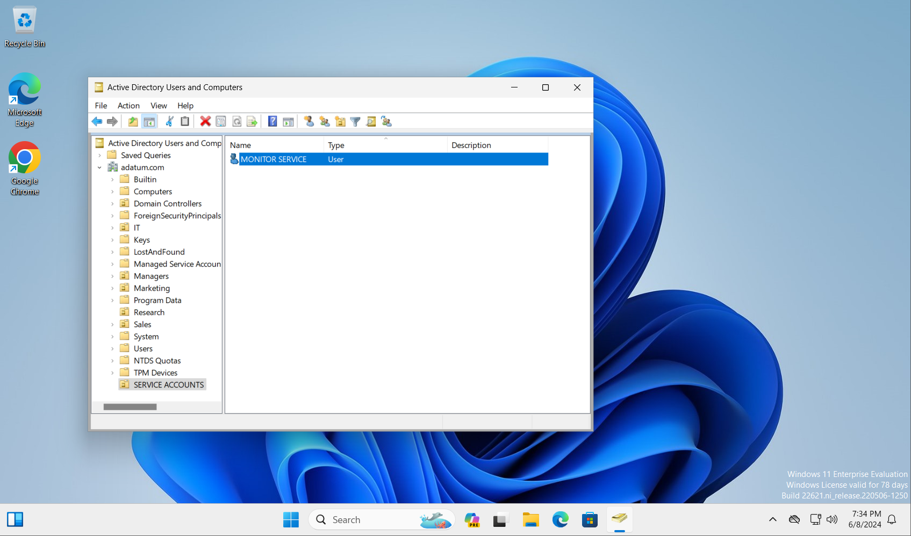
*Organizational Unit created for Service Accounts.*

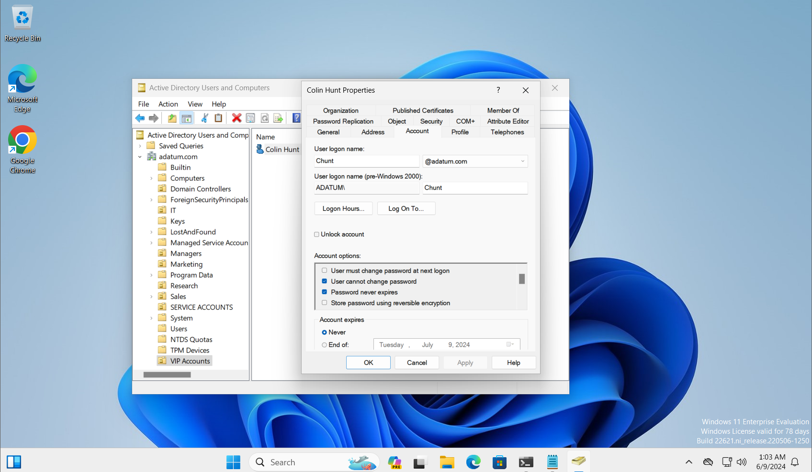
*User properties of a VIP user – Colin Hunt.*

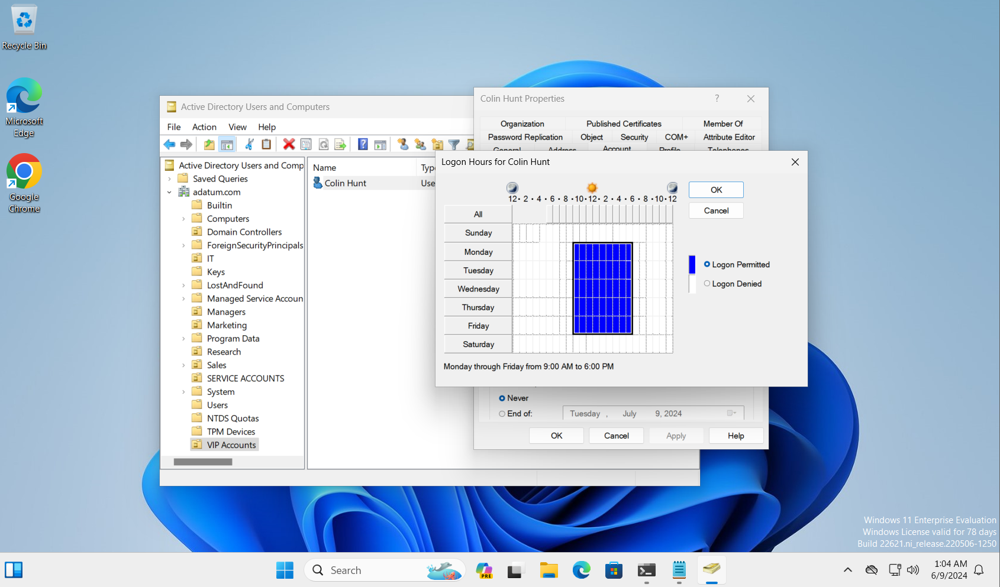
*Logon hours configured for weekdays, 9 AM to 6 PM.*

*User object protected from accidental deletion.*

### User Groups and Admin Center
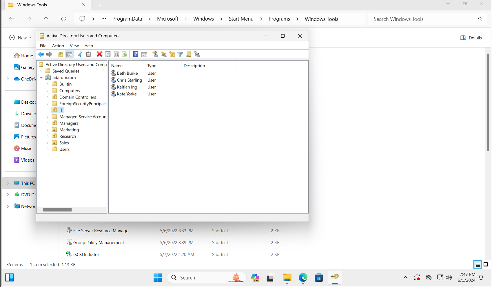
*IT OU with 4 users*

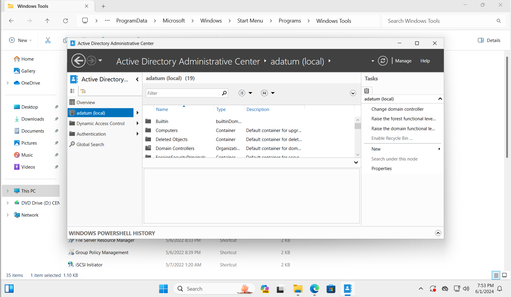
*Active Directory Administrative Center Overview*

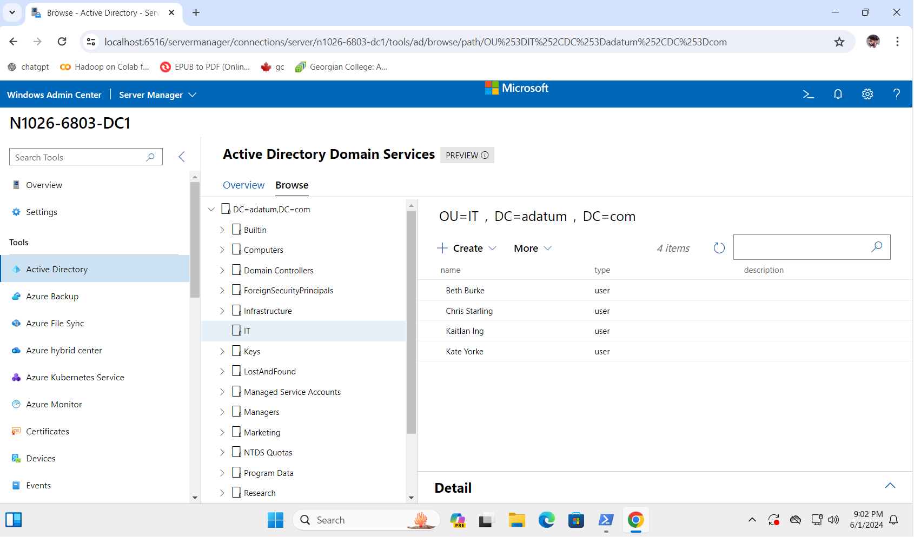
*Web Server Manager Active Directory view*

### Group Management & Delegation
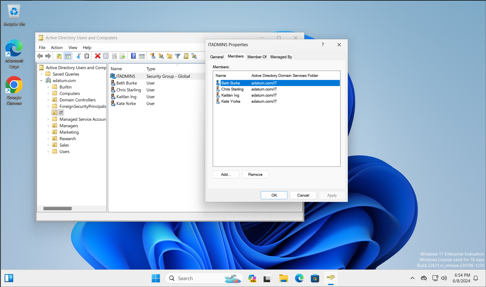
*ITADMINS group with 4 members*

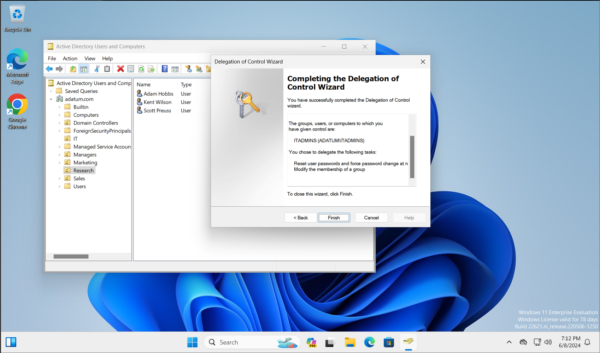
*Delegation of Control Wizard complete screen*

### OU Permissions & Security
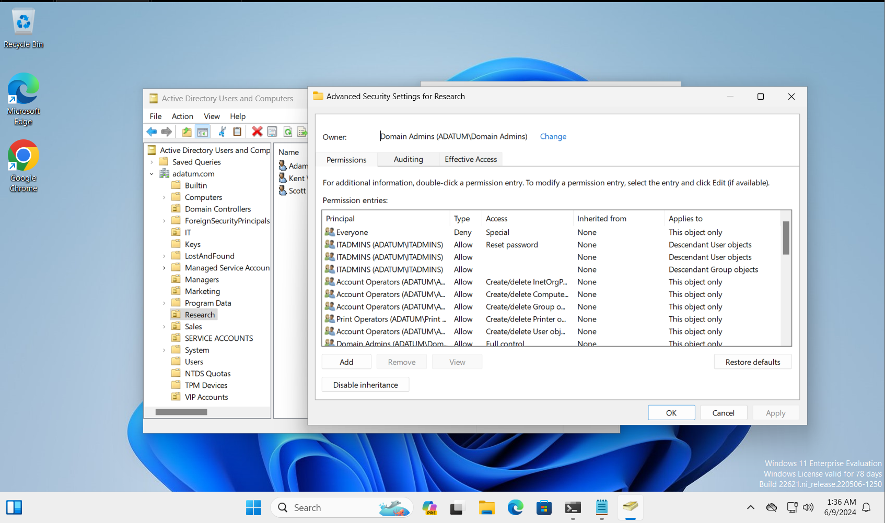
*Advanced Permissions - Research OU – advanced security settings*

### GPO Configuration
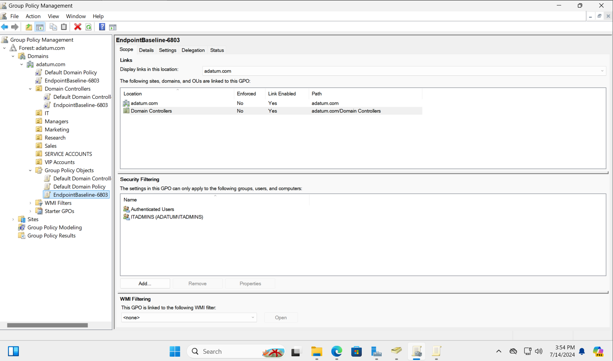
*Shows the EndpointBaseline-6803 GPO and its linked scope.*

### Firewall Configuration
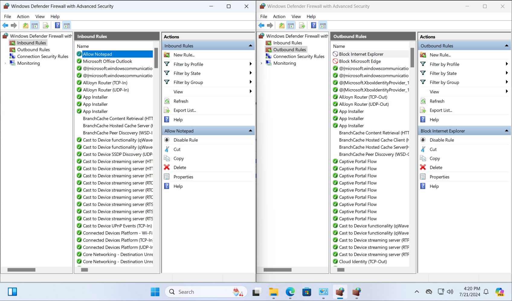
*Firewall Rules – Inbound & Outbound (notepad allowed, IE blocked).*

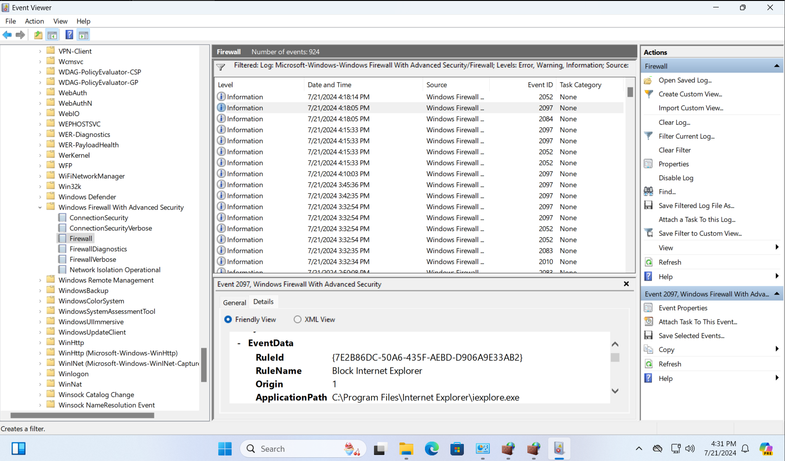
*Firewall Log – Event Viewer(Shows a log entry for the “Block Internet Explorer” firewall rule.)*

### GPO ADMX Templates
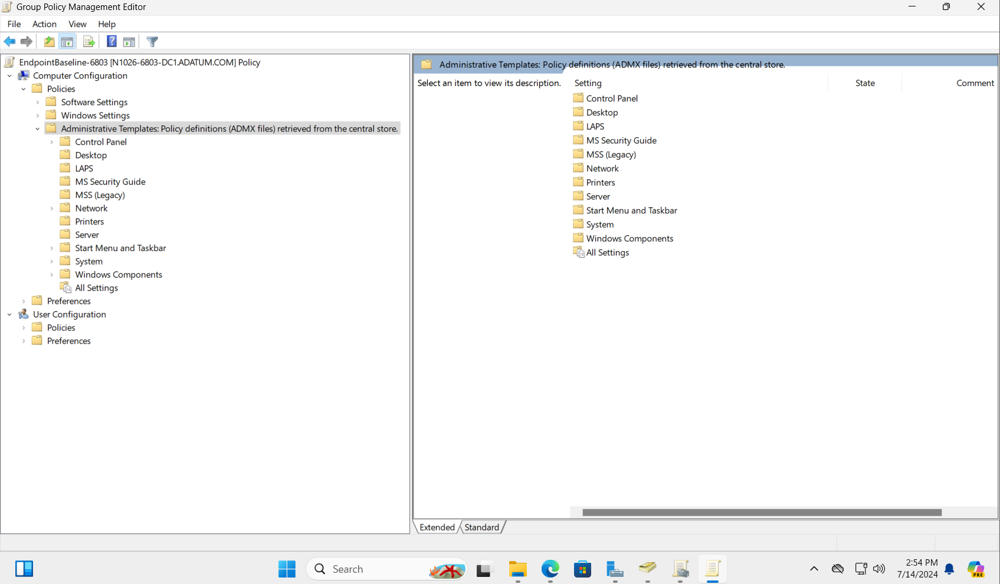
*ADMX Settings(GPO editor with ADMX templates from central store (Control Panel, LAPS, etc.))*
